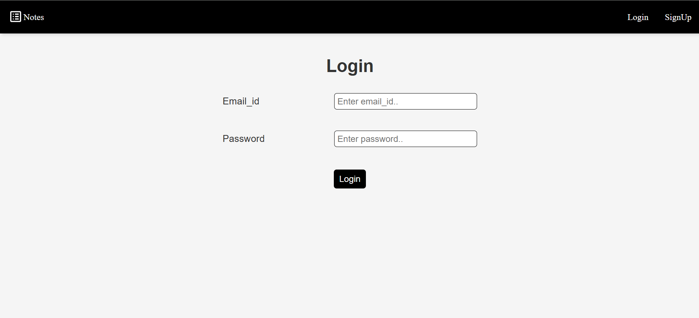
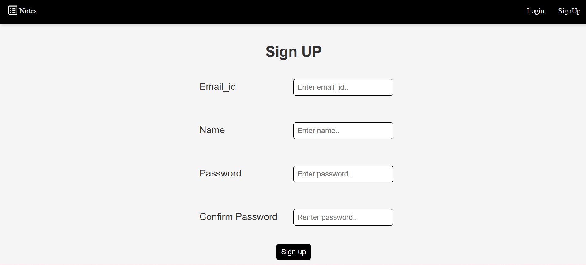

# 📝 Flask Notes App with User Authentication

A simple web app to take, save, and manage notes — built with Flask, Flask-Login, and SQLAlchemy.

## 🚀 Features

- ✅ User registration and login/logout
- 🔐 Secure user authentication (with password hashing)
- 🗒️ Create, view, and delete notes
- 🧠 Each user's notes are private and stored securely
- 📦 SQLite database integration
- 🌐 HTML & CSS templates using Jinja2

## 🛠️ Tech Stack

- **Backend**: Python, Flask, Flask-Login, SQLAlchemy
- **Frontend**: HTML5, CSS3, Jinja2 Templates
- **Database**: SQLite (can be upgraded to PostgreSQL/MySQL)
- **Authentication**: Session-based with secure password storage

